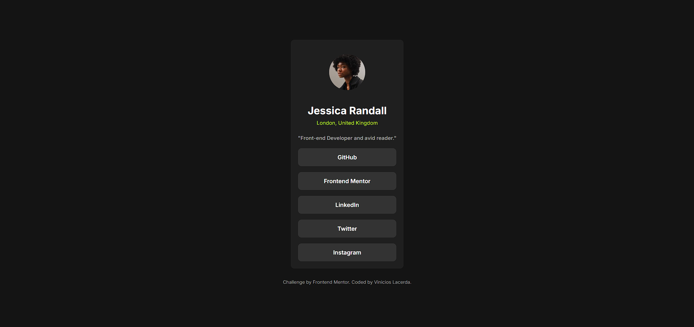

# Frontend Mentor - Social links profile


Esta é uma solução para o desafio [Social links profile challenge on Frontend Mentor](https://www.frontendmentor.io/challenges/social-links-profile-UG32l9E6Im). Os desafios do Frontend Mentor ajudam você a melhorar suas habilidades de codificação construindo projetos realistas.

## Índice

- [Frontend Mentor - Social links profile](#frontend-mentor---social-links-profile)
  - [Índice](#índice)
  - [Visão Geral](#visão-geral)
    - [O Desafio](#o-desafio)
    - [Screenshot](#screenshot)
    - [Links](#links)
  - [Meu Processo](#meu-processo)
    - [Construído com](#construído-com)
    - [O que eu aprendi](#o-que-eu-aprendi)
    - [Desenvolvimento Contínuo](#desenvolvimento-contínuo)
  - [Autor](#autor)
  - [Agradecimentos](#agradecimentos)

## Visão Geral

### O Desafio

O desafio consistia em construir uma página de perfil de links sociais e fazê-la parecer o mais próximo possível do design fornecido. Os usuários deveriam ser capazes de ver os estados de `hover` para todos os elementos interativos na página.

### Screenshot

Aqui está um screenshot do meu projeto finalizado:



### Links

- **URL da Solução:** https://www.frontendmentor.io/solutions/flexbox-utilizei-o-display-flex-para-realizar-o-invs-de-grid-XuFubzDGF6
- **URL do Site ao Vivo:** https://uhwdev.github.io/social-links/

## Meu Processo

### Construído com

- **HTML5 Semântico:** Para uma estrutura clara e acessível.
- **CSS3 Personalizado:** Utilizando propriedades modernas como:
  - Flexbox para alinhamento e centralização.
  - Variáveis de cor `hsl()` para fácil manutenção do tema.
  - Propriedades de `transition` para efeitos de `hover` suaves.
- **Fluxo de Trabalho Mobile-first:** Começando com o design para telas pequenas e depois adaptando para desktops.

### O que eu aprendi

Este projeto foi uma ótima oportunidade para solidificar meus conhecimentos em Flexbox e responsividade. Alguns pontos importantes que aprendi e pratiquei foram:

- **Centralização com Flexbox:** Usei `display: flex`, `justify-content: center` e `align-items: center` no `body` para centralizar o card de perfil de forma eficiente tanto na vertical quanto na horizontal.

```css
body {
  min-height: 100vh;
  display: flex;
  justify-content: center;
  align-items: center;
}
```

- **Boas Práticas de CSS:** Organizei o CSS com um reset básico, comentários para cada seção e usei `max-width` em vez de `width` fixo para garantir que o layout se adaptasse bem a diferentes tamanhos de tela.
- **Acessibilidade:** Prestei atenção em usar tags HTML semânticas e adicionei o atributo `rel="noopener noreferrer"` nos links que abrem em nova aba para maior segurança.

### Desenvolvimento Contínuo

Para futuros projetos, pretendo focar em:

- Explorar animações mais complexas com CSS.
- Integrar JavaScript para adicionar interatividade, como um "dark mode" (modo escuro).
- Praticar mais o fluxo de trabalho "mobile-first".

## Autor

- **Nome:** Vinicios Lacerda
- **Frontend Mentor:** [@uhwdev](https://www.frontendmentor.io/profile/uhwdev)
- **GitHub:** [@uhwdev](https://github.com/uhwdev)

## Agradecimentos

Agradeço ao Frontend Mentor por criar desafios tão incríveis que nos ajudam a crescer como desenvolvedores. A comunidade é fantástica e sempre motivadora.
